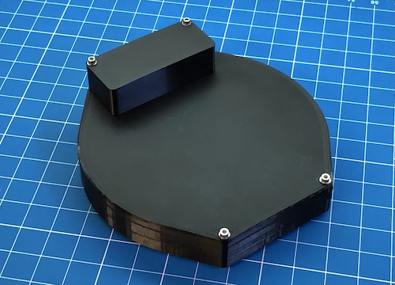
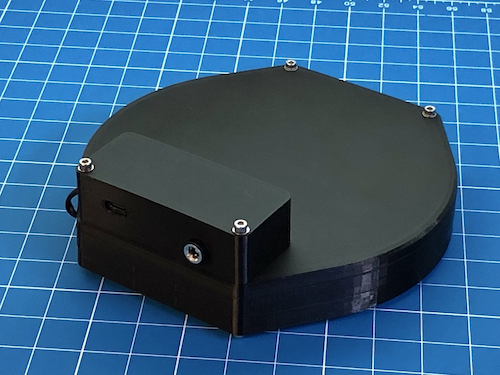
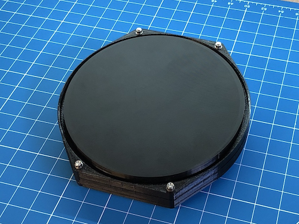
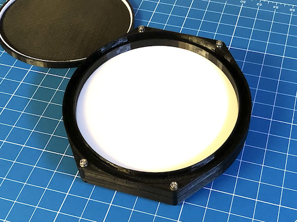
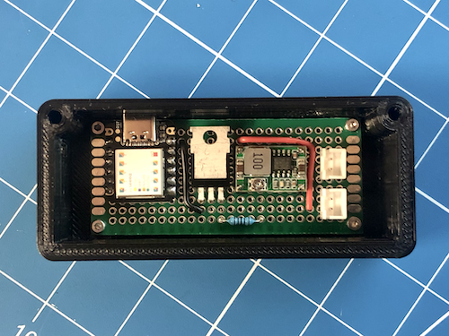
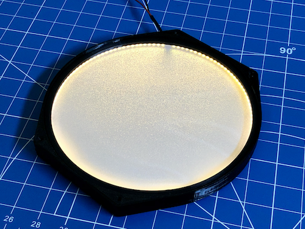
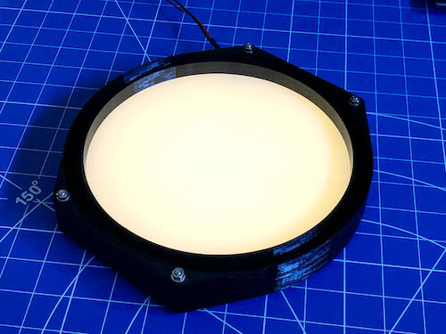

# ASCOM-Compatible Flat Panel

* [Introduction](#introduction)
* [Finished Product](#finished-product)
* [Pre-Requisites](#pre-requisites)
* [Hardware](#hardware)
* [Compiling The ASCOM Driver](#compiling-the-ascom-driver)
* [Installing The ASCOM Driver](#installing-the-ascom-driver)
* [Compiling The Arduino Firmware](#compiling-the-arduino-firmware)
* [Mechanical Components](#mechanical-components)
* [Electronic Circuit](#electronic-circuit)
* [Assembling The Flat Panel](#assembling-the-flat-panel)
* [Ideas For Future Enhancements](#ideas-for-future-enhancements)

## Introduction

Up until now, I have been using an OSC (One Shot Color) camera (ZWO ASI533MC Pro) to capture images of the night sky with my telescope, along with two filters, a Luminance (L) filter (I use an Astronomik L3 because my budget APO has some residual chromatism in the blue part of the spectrum) and a dual narrowband filter (Optolong L-eXtreme). This makes taking flats relatively easy. I just use an LED tracing panel, which I bought for $20 on Amazon, and I dim the panel using a few sheets of paper in order to accommodate the stark difference in transmission between the two filters (the transmission ratio between these two filters, for a light source that has a relatively broad spectrum, is roughly 1 to 20!)

Recently, in order to get better results, both in terms of SNR and resolution, and to gain more flexibility, specifically with narrowband targets, I have decided to switch to a monochrome camera (I settled on the new and very reasonably priced ZWO ASI533MM Pro). This means that going forward, I will be going from 2 filters to 7 filters (L, R, G, B, H⍺, OIII, SII)! All these filters have wildly varying transmission characteristics, and that makes taking flats a lot more time consuming and difficult.

The solution is relatively straightforward, however. An ASCOM-compatible flat panel is capable of modulating its brightness, and software like N.I.N.A., for example, can control it to adjust its brightness for each filter, while respecting the criteria you set (minimum/maximum exposure time, histogram mean, etc.) The only problem is that commercial flat panels can be quite expensive (depending on their diameter), and unless you are lucky, the flat panel you purchase will likely be bigger than you really need. For instance, for my AT130EDT refractor, the Gerd Neumann flat panel closest in size would be able to fit a 220mm diameter telescope, which is a lot bigger than I need!

What I want is a [high quality](https://github.com/jlecomte/circular-led-flat-panel-evaluation), affordable (BOM cost ~ $50), yet professional looking ASCOM-compatible flat panel that would be the perfect size for my telescope. The only way to get that was to design it and built it myself, and that is what I did. In this repository, I share everything you need to build your own.

## Finished Product

Here is what the finished product looks like:









## Pre-Requisites

* A Windows computer (I know what you're thinking... The good news is that with [ASCOM Alpaca](https://www.ascom-standards.org/Developer/Alpaca.htm), we will soon have a truly multi-platform solution... Until then, we're just using the Windows-specific ASCOM implementation)
* [Microsoft Visual Studio](https://visualstudio.microsoft.com/) (FYI, I used the 2022 edition...)
* [ASCOM Platform](https://ascom-standards.org/)
* [ASCOM Platform Developer Components](https://ascom-standards.org/COMDeveloper/Index.htm)
* [Arduino IDE](https://www.arduino.cc/en/software)
* [FreeCAD](https://www.freecadweb.org/), a free and open-source 3D parametric modeler
* A 3D printer able to print PETG, and a slicer (I use a heavily upgraded Creality Ender 3 v2, and Ultimaker Cura)
* A few basic tools that any tinkerer must own...

## Hardware

The following are just suggestions... Also, over time, some of the Amazon links may no longer work... But it should help get you started.

* [Seeeduino XIAO](https://www.seeedstudio.com/Seeeduino-XIAO-Arduino-Microcontroller-SAMD21-Cortex-M0+-p-4426.html) (You can get it quicker from Amazon, but you will have to pay twice as much!)
* [IRF520N MOSFET](https://www.amazon.com/dp/B082J3FNJS)
* 1KΩ resistor
* [Perforated Circuit Board](https://www.amazon.com/dp/B07NM68FXK)
* [DC Power Jack](https://www.amazon.com/dp/B01N8VV78D)
* [Bench Power Supply](https://www.amazon.com/dp/B07GCJ5QHF)
* [Taloya LED Flush Mount Ceiling Light](https://www.amazon.com/dp/B08GX81JB1) (to extract the background disk and the LGP)
* [High Density white LED strip](https://www.amazon.com/dp/B07X53HXY1)
* [White Acrylic Sheet](https://www.amazon.com/dp/B083XQ2QS7) (to make the diffuser)
* [Threaded inserts for 3D printed parts](https://www.amazon.com/dp/B07VFZWWXY)
* [Assortment of small metric screws, nuts, and washers](https://www.amazon.com/dp/B08JCKH31Q)
* [22AWG solid core electrical wires](https://www.amazon.com/dp/B088KQFHV7)
* [Easy-to-print PETG filament](https://www.amazon.com/dp/B07PGYHYV8)

## Compiling The ASCOM Driver

Open Microsoft Visual Studio as an administrator (right click on the Microsoft Visual Studio shortcut, and select "Run as administrator"). This is required because when building the code, by default, Microsoft Visual Studio will register the compiled COM components, and this operation requires special privileges (Note: This is something you can disable in the project settings...) Then, open the solution (`ASCOM_Driver\ASCOM.DarkSkyGeek.CoverCalibrator.sln`), change the solution configuration to `Release` (in the toolbar), open the `Build` menu, and click on `Build ASCOM Driver`. As long as you have properly installed all the required dependencies, the build should succeed and the ASCOM driver will be registered on your system.

## Installing The ASCOM Driver

If you are planning to use the ASCOM driver on a separate computer, you can install it manually, using `RegAsm.exe`. Just don't forget to use the 64 bit version, and to pass the `/tlb /codebase` flags. I know, it's Windows... Anyway, here is what it looked like on my imaging mini computer:

```
> C:\Windows\Microsoft.NET\Framework64\v4.0.30319\RegAsm.exe /tlb /codebase ASCOM.DarkSkyGeek.CoverCalibrator.dll
Microsoft .NET Framework Assembly Registration Utility version 4.8.4161.0
for Microsoft .NET Framework version 4.8.4161.0
Copyright (C) Microsoft Corporation.  All rights reserved.

Types registered successfully
```

## Compiling The Arduino Firmware

* Add support for Seeeduino boards by following [the instructions from the board manufacturer](https://wiki.seeedstudio.com/Seeeduino-XIAO/).
* To customize the name of the device when connected to your computer, open the file `boards.txt`, which, on my system and for the version of the Seeeduino board I am using, is located at `%LOCALAPPDATA%\Arduino15\packages\Seeeduino\hardware\samd\1.8.2\boards.txt`. Then, change the value of the key `seeed_XIAO_m0.build.usb_product` from `Seeed XIAO M0` (default) to whatever you'd like. I set it to `DarkSkyGeekʼs ASCOM Flat Panel`.
* Finally, connect your Seeeduino board to your computer (make sure you use a USB-C cable that supports data and not just power!), open the sketch file located at `Arduino_Firmware\Arduino_Firmware.ino`, and click on the `Upload` button in the toolbar.

## Mechanical Components

The STL files you will find in the `3D_Files/STL/` folder are just a starting point. You will likely have to create your own version of this project, if only to match the size of the panel to your own OTA... That is why I included the FreeCAD model in this repository (`3D_Files/Freecad_Model.FCStd`). Since there are no moving parts, it is a relatively simple assembly.

## Electronic Circuit

The electronics circuit is trivial. I included a Fritzing file in the `Electronics/` folder. Here are the schematics:


Here is what the finished electronic circuit looks like:



In the photograph above, the components were soldered onto a 70mm x 30mm PCB.

## Assembling The Flat Panel

The most difficult part of this project is to cleanly and solidly solder wire leads to the appropriate length of LED strip. Once I have a good solder joint, I usually put a nice glob of epoxy resin on and around it to provide some mechanical reinforcement. Then, the LED strip is stuck against the inside of the panel body. The LGP, cut to size, is inserted and should barely fit within the LED strip, pushing the LEDs against the wall of the panel body. Finally, the spacer is placed on top of the LGP, the diffusing sheet sits on top of the spacer, and the front part of the panel is bolted to the back. Here are a few photos to illustrate this process:






## Ideas For Future Enhancements

* This flat panel could potentially be integrated in the [ASCOM Telescope Cover](https://github.com/jlecomte/ascom-telescope-cover). I decided not to do that because, in my case, it would have added too much weight to the front of my already front-heavy OTA, making it more difficult to balance, and causing all kinds of issues with the camera possibly hitting the tripod legs since the OTA would have to be moved back to provide proper balance.
